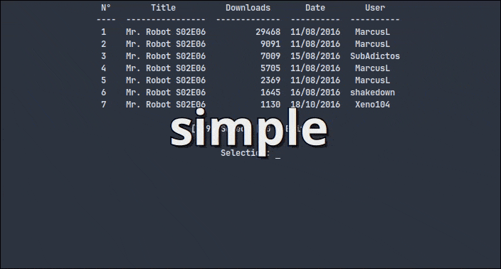
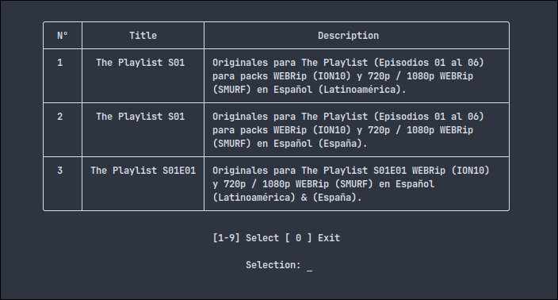
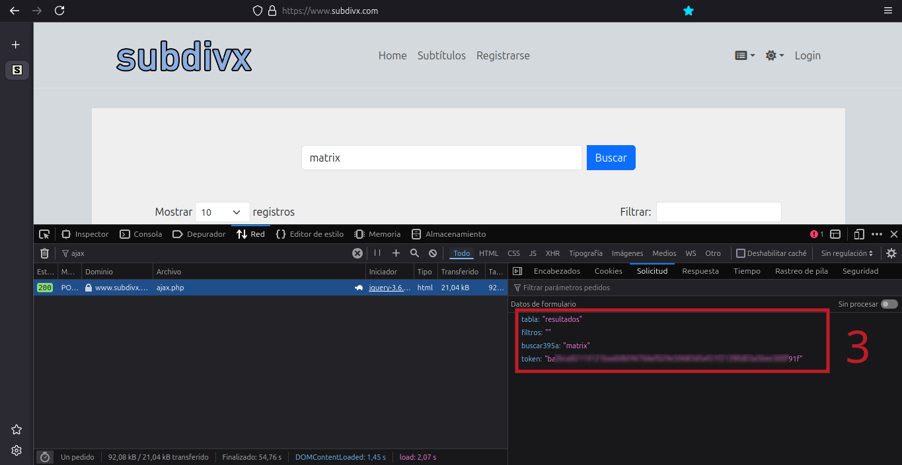
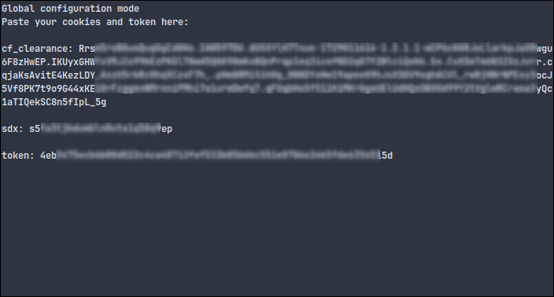
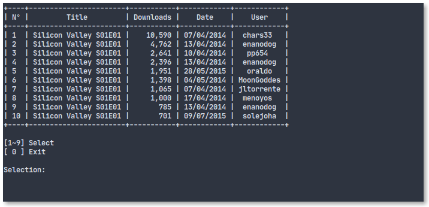
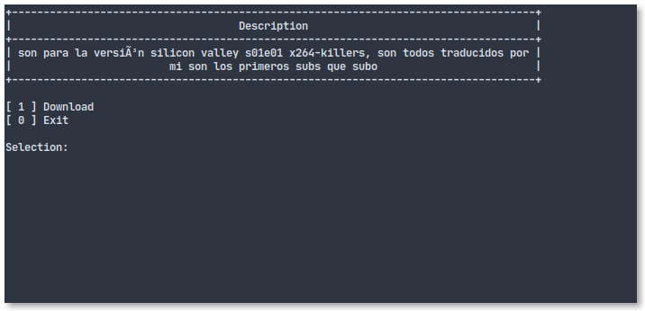
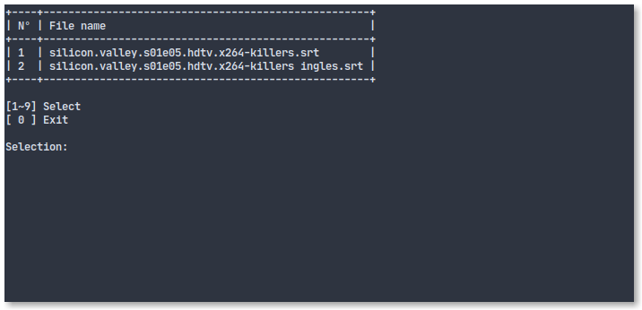
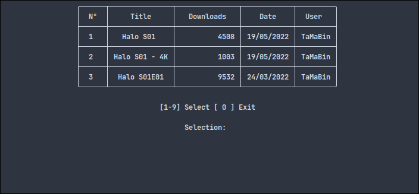
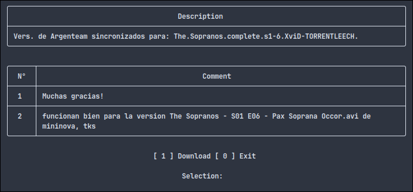

# Subdivx-dl
Herramienta de línea de comandos para buscar y descargar subtítulos del sitio www.subdivx.com

## Otro idioma
- [English](README.md) 

## INSTALACIÓN
Puedes instalar subdivx-dl siguiendo estos pasos:

Descarga el repositorio

    git clone www.github.com/csq/subdivx-dl

Ingresa en la carpeta ``subdivx-dl`` y ejecuta

    pip install .

### DEPENDENCIAS
Python 3.6+ son compatibles. Otras versiones e implementaciones pueden funcionar correctamente o no.

Librerias:
* Tabulate
* Urllib3
* Rarfile
* Guessit

## USO Y OPCIONES
    subdivx-dl [OPCIONES][BUSQUEDA]

### Opciones Generales:
    -h, --help                          Imprimir el texto de ayuda y salir
    -V, --version                       Imprimir la versión del programa y salir
    -cu, --check-update                 Comprobar disponibilidad de actualizaciones
    -s, --season                        Descargar subtítulos para toda la temporada
    -l, --location UBICACIÓN            Especificar el directorio de destino
    -n, --lines LÍNEAS                  Limitar el número de resultados
    -st, --style ESTILO                 Mostrar resultados en el estilo seleccionado
    -a, --alternative                   Mostrar resultados utilizando un diseño alternativo
    -cmp, --compact                     Mostrar resultados en un diseño compacto
    -m, --minimal                       Mostrar resultados en un diseño minimo
    -nr, --no-rename                    Deshabilitar el renombrado de archivos
    -c, --comments                      Mostrar comentarios
    -f, --fast                          Descargar directamente el mejor subtítulo coincidente
    -odownloads, --order-by-downloads   Ordenar por número de descargas
    -odates, --order-by-dates           Ordenar resultados por fechas
    -sc, --save-config                  Guardar configuración
    -lc, --load-config                  Cargar configuración
    -v, --verbose                       Habilitar salida detallada

#### Ejemplos
Estos ejemplos muestran la operación habitual  

Buscar y descargar un solo subtítulo en el directorio actual  

    subdivx-dl 'Silicon Valley S01E01'  

    or  

    subdivx-dl 'The.Matrix.Revolutions.2003.REMASTERED.1080p.10bit.BluRay.8CH.x265.HEVC-PSA.mkv'  

Buscar y descargar múltiples subtítulos en el mismo directorio  

    subdivx-dl -s 'Silicon Valley S01'

Buscar y descargar un subtítulo en un directorio específico (el directorio se crea si no existe)

    subdivx-dl -l ~/Downloads/MyDirectory/ 'Silicon Valley S01E01'

Buscar y descargar un subtítulo pero sin cambiar el nombre del archivo (mantener el nombre de origen)  

    subdivx-dl -nr 'Matrix'

Buscar subtítulo incluyendo los comentarios  

    subdivx-dl -c 'Halo S01E01'

Descarga directamente el mejor subtítulo

    subdivx-dl -f 'It Crowd S02E01'

#### Estilos
Es posible aplicar diferentes estilos a las tablas que muestan los resultados utilizando las opciones ``-st`` o ``--style`` y especificando el nombre del estilo deseado. Las opciones disponible son: ``simple``, ``grid``, ``pipe``, ``presto``, ``orgtbl``, ``psql``, ``rst``, ``simple_grid``, ``rounded_grid``, ``fancy_grid``, ``heavy_grid``, ``double_grid`` y ``mixed_grid``. Si no se especifica un estilo, se utilizará el predeterminado ``rounded_grid``.

#### Todos los estilos

  

#### Opciones de Diseño

- **`-a`, `--alternative`**: Muestra los resultados en un formato alternativo, presentando el título y la descripción uno al lado del otro.  

- **`-cmp`, `--compact`**: Muestra los resultados en tablas individuales, con el título y la descripción presentados en la misma tabla.  

- **`-m`, `--minimal`**: Presenta los resultados en un formato minimalista, mostrando el título, las descargas y las fechas.  

#### Gestión de la configuración
Para guardar las opciones frecuentemente utilizadas con el comando ``subdivx-dl``, se implementan siguientes opciones:
* ``-sc`` o ``--save-config``: permite guardar los argumentos ingresados.
* ``-lc`` o ``--load-config``: permite realizar búsquedas con argumentos previamente guardados.

Los datos se guardan en:
    * Windows: ``C:\Users\nombre_de_usuario\AppData\Local\subdivx-dl\``
    * Linux: ``~/.config/subdivx-dl/``

### Capturas de pantalla
Vista de resultados de búsqueda  

Vista de descripción  

Vista de selección: en caso de tener múltiples subtítulos  

Vista de resultados de búsqueda en formato ``rounded_grid``  

Vista de descripción con comentarios en formato ``rounded_grid``  

## Solución de problemas

**Subtitles not found**

Si el mensaje 'Subtitles not found', se muestra constantemente, sigue estos pasos:

* Elimina la cookie llamada **sdx-dl** en la carpeta temporal.  
    * Windows: ``C:\Users\nombre_de_usuario\AppData\Local\Temp``  
    * Linux: ``/tmp``  
* Realiza la búsqueda nuevamente

**Uncompress rar files**

El módulo ``rarfile`` especifica:
>Los archivos comprimidos se extraen ejecutando una herramienta externa: unrar (preferido), unar, 7zip o bsdtar.

Por lo tanto, debes tener una de estas herramientas instaladas.

### Autor
subdivx-dl fue creado por [Carlos Quiroz](https://github.com/csq/)

### Descargo de responsabilidad
subdvix.com no participa en este desarrollo.

### Licencia
Licencia Pública General de GNU v3.0 o posterior  

Consulta [COPYING](COPYING) para ver el texto completo.
