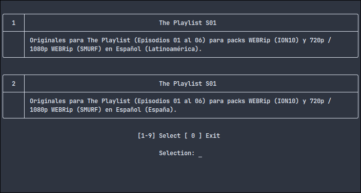

# Subdivx-dl
Herramienta de línea de comandos para buscar y descargar subtítulos de www.subdivx.com

### Otro idioma
- [English](README.md)

## INSTALACIÓN
Puedes instalar subdivx-dl siguiendo estos pasos:

* Descarga el repositorio
    ```bash
        git clone www.github.com/csq/subdivx-dl
    ```
* Ingresa en la carpeta ``subdivx-dl`` y ejecuta
    ```bash
        pip install .
    ```

## DEPENDENCIAS
Python 3.6+ son compatibles. Otras versiones e implementaciones pueden funcionar correctamente o no.

* **Guessit**: Extrae metadatos de los nombres de archivos multimedia.
* **Certifi**: Colección de certificados raíz para la validación de SSL/TLS.
* **Urllib3**: Cliente HTTP para realizar solicitudes y manejar respuestas.
* **Tabulate**: Formatea y muestra datos en tablas para una mejor legibilidad.
* **Rarfile**: Lee y extrae archivos de archivos RAR.

## USO Y OPCIONES
```bash
    subdivx-dl [OPCIONES] [BUSQUEDA]
```
### Opciones Generales:
```
    Opciones:
        -h, --help                          Imprimir el texto de ayuda y salir

    Inicio:
        -V, --version                       Imprimir la versión del programa y salir
        -v, --verbose                       Habilitar salida detallada
        -cu, --check-update                 Comprobar disponibilidad de actualizaciones
        -dh, --disable-help                 Desabilitar los mensajes de ayuda

    Descargar:
        -s, --season                        Descargar subtítulos para toda la temporada
        -l, --location UBICACIÓN            Especificar el directorio de destino
        -nr, --no-rename                    Deshabilitar el renombrado de archivos
        -ne, --no-exit                      Desabilitar salida automática
        -f, --fast                          Descargar directamente el mejor subtítulo coincidente

    Ordenar por:
        -odownloads, --order-by-downloads   Ordenar por número de descargas
        -odates, --order-by-dates           Ordenar resultados por fechas

    Resultados:
        -n, --lines LÍNEAS                  Limitar el número de resultados
        -c, --comments                      Mostrar comentarios

    Diseño:
        -m, --minimal                       Mostrar resultados en un diseño minimo
        -a, --alternative                   Mostrar resultados utilizando un diseño alternativo
        -cmp, --compact                     Mostrar resultados en un diseño compacto

    Estilo:
        -st, --style ESTILO                 Mostrar resultados en el estilo seleccionado

    Configuración:
        -sc, --save-config                  Guardar configuración
        -lc, --load-config                  Cargar configuración
```

## EJEMPLOS DE USO
Estos ejemplos muestran la operación habitual

Buscar y descargar un solo subtítulo en el directorio actual
```bash
    subdivx-dl 'Silicon Valley S01E01'
```
```bash
    subdivx-dl 'The.Matrix.Revolutions.2003.REMASTERED.1080p.10bit.BluRay.8CH.x265.HEVC-PSA.mkv'
```
Buscar y descargar múltiples subtítulos en el mismo directorio
```bash
    subdivx-dl -s 'Silicon Valley S01'
```
Buscar y descargar un subtítulo en un directorio específico (el directorio se crea si no existe)
```bash
    subdivx-dl -l ~/Downloads/MyDirectory/ 'Silicon Valley S01E01'
```
Buscar y descargar un subtítulo pero sin cambiar el nombre del archivo (mantener el nombre de origen)
```bash
    subdivx-dl -nr 'Matrix'
```
Buscar subtítulo incluyendo los comentarios
```bash
    subdivx-dl -c 'Halo S01E01'
```
Buscar subtítulos usando el ID de IMDb
```bash
    subdivx-dl 'tt0113243'
```
```bash
    subdivx-dl 'https://www.imdb.com/es/title/tt0113243/'
```
Descarga directamente el mejor subtítulo
```bash
    subdivx-dl -f 'It Crowd S02E01'
```

## PERSONALIZACIÓN VISUAL
### Estilos
Es posible aplicar diferentes estilos a las tablas que muestan los resultados utilizando las opciones ``-st`` o ``--style`` y especificando el nombre del estilo deseado. Las opciones disponible son: ``simple``, ``grid``, ``pipe``, ``presto``, ``orgtbl``, ``psql``, ``rst``, ``simple_grid``, ``rounded_grid``, ``fancy_grid``, ``heavy_grid``, ``double_grid`` y ``mixed_grid``. Si no se especifica un estilo, se utilizará el predeterminado ``rounded_grid``.

<p align="center">
  
</p>

### Opciones de Diseño
- **`-a`, `--alternative`**: Muestra los resultados en un formato alternativo, presentando el título y la descripción uno al lado del otro.
<p align="center">
  
</p>

- **`-cmp`, `--compact`**: Muestra los resultados en tablas individuales, con el título y la descripción presentados en la misma tabla.
<p align="center">
  
</p>

- **`-m`, `--minimal`**: Presenta los resultados en un formato minimalista, mostrando el título, las descargas y las fechas.
<p align="center">
  
</p>

## CONFIGURACIÓN
### Gestión de la configuración
Para guardar las opciones frecuentemente utilizadas con el comando ``subdivx-dl``, se implementan siguientes opciones:
* ``-sc`` o ``--save-config``: permite guardar los argumentos ingresados.
* ``-lc`` o ``--load-config``: permite realizar búsquedas con argumentos previamente guardados.

Los datos se guardan en:
    * Windows: ``C:\Users\nombre_de_usuario\AppData\Local\subdivx-dl\``
    * Linux: ``~/.config/subdivx-dl/``

## Solución de problemas
**Uncompress rar files**

El módulo ``rarfile`` especifica:
>Los archivos comprimidos se extraen ejecutando una herramienta externa: unrar (preferido), unar, 7zip o bsdtar.

Por lo tanto, debes tener una de estas herramientas instaladas.

**ID IMDb válido sin resultados**

Un ID de IMDb válido puede no devolver resultados debido a un problema externo con subdivx.com. La solución es buscar por nombre de archivo o palabras clave.

# CRÉDITOS Y LEGAL
### Autor
subdivx-dl fue creado por [Carlos Quiroz](https://github.com/csq/)

### Descargo de responsabilidad
subdivx.com no está involucrado en este desarrollo.

### Licencia
Licencia Pública General de GNU v3.0 o posterior
Consulta [COPYING](COPYING) para ver el texto completo.