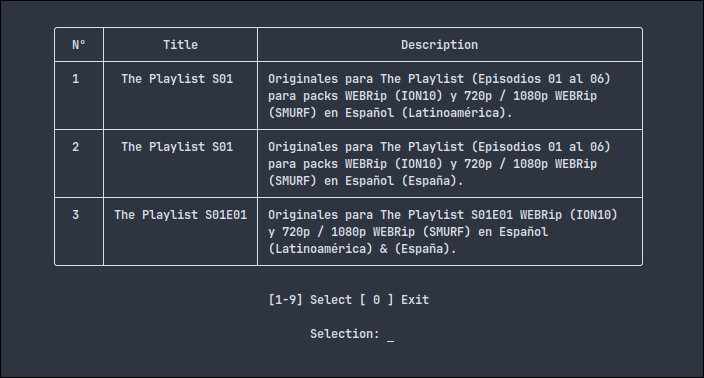
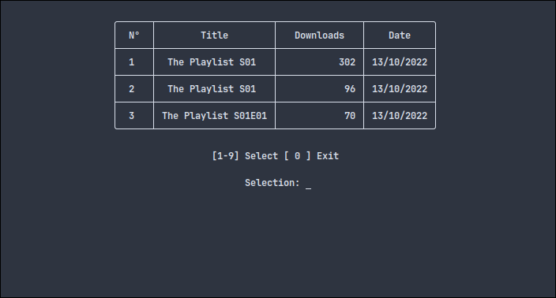

# Subdivx-dl
CLI tool for searching and downloading subtitles from www.subdivx.com

### Other language
- [Español](README-es.md)

## INSTALLATION
You can install subdivx-dl by following these steps:

* Download the repository
    ```bash
        git clone www.github.com/csq/subdivx-dl
    ```
* Enter into the folder ``subdivx-dl`` and execute
    ```bash
        pip install .
    ```

## DEPENDENCIES
Python versions 3.6+ are supported. Other versions and implementations may or may not work correctly.

* **Guessit**: Extracts metadata from media filenames.
* **Certifi**: Collection of root certificates for SSL/TLS validation.
* **Urllib3**: HTTP client for making requests and handling responses.
* **Tabulate**: Formats and displays data in tables for better readability.
* **Rarfile**: Reads and extracts files from RAR archives.

## USAGE AND OPTIONS
```bash
    subdivx-dl [OPTIONS] [SEARCH]
```
### General options:
```
    Options:
        -h, --help                          Print the help text and exit

    Startup:
        -V, --version                       Print program version and exit
        -v, --verbose                       Enable verbose output
        -cu, --check-update                 Check availability of updates
        -dh, --disable-help                 Disable help messages

    Download:
        -s, --season                        Download subtitles for the entire season
        -l, --location LOCATION             Specify the destination directory
        -nr, --no-rename                    Disable file renaming
        -ne, --no-exit                      Disable automatic exit
        -f, --fast                          Directly download the best matching subtitle

    Order-by:
        -odates, --order-by-dates           Order results by dates
        -odownloads, --order-by-downloads   Order by number of downloads

    Results:
        -n, --lines LINES                   Limit the number of results
        -c, --comments                      Display comments

    Layout:
        -m, --minimal                       Show results in a minimal layout
        -a, --alternative                   Show results using an alternative layout
        -cmp, --compact                     Show results in a compact layout

    Style:
        -st, --style STYLE                  Show results in the selected style

    Configuration:
        -sc, --save-config                  Save configuration
        -lc, --load-config                  Load configuration
```

## USAGE EXAMPLES
These examples show habitual operation

Search and download a single subtitle in the current directory
```bash
    subdivx-dl 'Silicon Valley S01E01'
```
```bash
    subdivx-dl 'The.Matrix.Revolutions.2003.REMASTERED.1080p.10bit.BluRay.8CH.x265.HEVC-PSA.mkv'
```
Search and download multiples subtitles in same directory
```bash
    subdivx-dl -s 'Silicon Valley S01'
```
Search and download a subtitle in specific directory (directory is create if it does not exist)
```bash
    subdivx-dl -l ~/Downloads/MyDirectory/ 'Silicon Valley S01E01'
```
Search and download a subtitle but not renaming file (keep name of origin)
```bash
    subdivx-dl -nr 'Matrix'
```
Search subtitle including their comments
```bash
    subdivx-dl -c 'Halo S01E01'
```
Search subtitles using IMDb ID
```bash
    subdivx-dl 'tt0113243'
```
```bash
    subdivx-dl 'https://www.imdb.com/es/title/tt0113243/'
```
Download the best subtitle directly
```bash
    subdivx-dl -f 'It Crowd S02E01'
```

## VISUAL PERSONALIZATION
### Style
It is possible to apply different styles to the tables that display the results using the ``-st`` or ``--style`` options and specifying the desired style name. The available options are: ``simple``, ``grid``, ``pipe``, ``presto``, ``orgtbl``, ``psql``, ``rst``, ``simple_grid``, ``rounded_grid``, ``fancy_grid``, ``heavy_grid``, ``double_grid`` and ``mixed_grid``. If no style is specified, the default ``rounded_grid`` will be used.

<p align="center">
  
</p>

### Layout Options
- **`-a`, `--alternative`**: Displays results in an alternative format, presenting the title and description side by side.
<p align="center">
  
</p>

- **`-cmp`, `--compact`**: Shows results in individual tables, with the title and description presented in the same table.
<p align="center">
  
</p>

- **`-m`, `--minimal`**: Presents results in a minimalist format, showcasing the title, downloads, and dates.
<p align="center">
  
</p>

## CONFIGURATION
### Configuration Management
To save frequently used options for the ``subdivx-dl`` command, the following options are implemented:
* ``-sc`` or ``--save-config``: allows you to save the entered arguments.
* ``-lc`` or ``--load-config``: allows you to perform searches with previously saved arguments.

* The data is stored in:
    * Windows: ``C:\Users\user_name\AppData\Local\subdivx-dl\``
    * Linux: ``~/.config/subdivx-dl/``

## Troubleshooting
**Uncompress rar files**

The module ``rarfile`` specifies:
>Compressed files are extracted by executing external tool: unrar (preferred), unar, 7zip or bsdtar.

Therefore, you must have one of these tools installed.

**Valid IMDb ID returns no results**

A valid IMDb ID may not return results due to an external issue with subdivx.com. The solution is to search by file name or keywords.

## CREDITS AND LEGAL
### Author
subdivx-dl was created by [Carlos Quiroz](https://github.com/csq/)

### Disclaimer
subdivx.com is not involved in this development.

### License
GNU General Public License v3.0 or later
See [COPYING](COPYING) to see the full text.